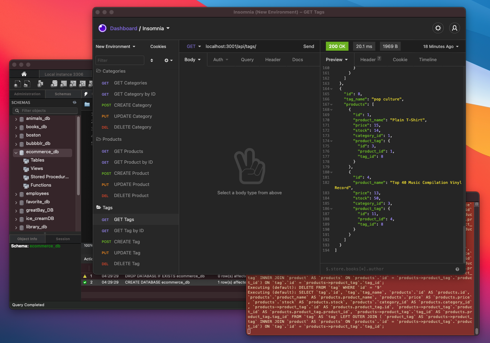

# 13-ORM eCommerce Backend

## Description
  Modified and added additional code to configure a working Express.js API to use Sequelize to interact with a MySQL database.
## Demo Video

## Table of Contents
- [Installation](#installation)
- [Usage](#usage)
- [Contributing](#contributing)
- [License](#license)
- [Tests](#test)
- [Questions](#questions)
## Installation
  Clone repo, run "npm i", run "npm run seed", and finally run "node server.js"
## Usage
  To validate routes, use a program like Insomnia to check each route and perform each database CRUD function.
## Contributing
  N/A

## License

## Tests
  no testing
## Questions
  Any Questions? Please contact me at one of the following for more information:

  [Github](https://github.com/davidboerm)  
  [LinkedIn](https://www.linkedin.com/in/davidboerm/)  
  [davidboerm@gmail.com](mailto:davidboerm@gmail.com)
